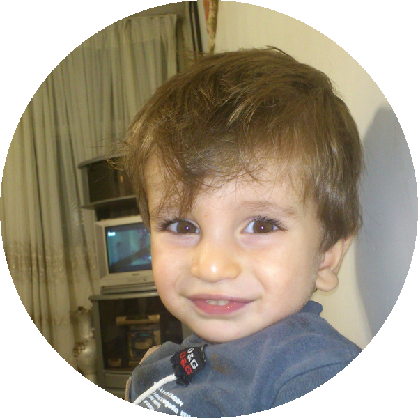

### Heyyyy I'm Arsalan

#### 💻 Computer Student • 🥊 Boxer • 🎵 Music Enthusiast

#### 16 years old • Tehran, Iran🦁

  <a href="https://github.com/PrimeRkz">GitHub</a> •
  <a href="https://www.instagram.com/deadrxkz?stkn=M3o5dTJ3dzN0bmx1">Instagram</a>  •
  <a href="https://t.me/RxkzMusic">Telegram</a>

 

---

## 🤔 About Me

I'm Arsalan, a 16-year-old computer science student
from Tehran, Iran. I've been around computers since I was 8,
and what started as a childhood interest slowly became something
I genuinely enjoy.

My journey with computers actually started with Minecraft.
I spent years playing it, learning the game, experimenting with
different things, and eventually becoming pretty good at it.
I kept playing until about a year ago. Looking back, Minecraft
was probably one of the first things that made me spend so much
time around computers and the digital world.

When I was 13, I started becoming interested in programming.
I wanted to understand how things were made instead of only using
them, and that eventually led me to web development.

I started learning HTML & CSS, experimenting with different
layouts and designs and slowly understanding how websites are
structured and built. I still have a lot to learn, and there are
things I've learned before that I've forgotten over time, but
I'm still interested in getting better and building on what I
already know.

Right now, I'm especially interested in Front-End Development
and Computer Networking. I haven't decided exactly which
direction I want to take in the future, so I'm keeping an open
mind and exploring different parts of technology.

My interest in computers isn't only about programming either.
Over the years I've also gotten into photo editing and a
little video editing, and I enjoy experimenting with different
creative things. I think a big part of my interest in technology
comes from the fact that I've been around computers since I was
a kid.

Outside of technology, I've been training **boxing for about a
year**. What I like about boxing isn't just the fighting itself.
The mentality, discipline, training, technique, and the way
everything comes together are what make it interesting to me.
I'm especially drawn to the Soviet/Russian style of boxing.

Music is another big part of my world. I enjoy **alternative,
indie, atmospheric music, trap and UK rap**. Music is something
I naturally come back to while I'm working, training, editing,
or just spending time on my own.

I'm still learning, experimenting and figuring things out.
I don't have everything planned yet, but I want to keep exploring
technology, improving my skills, and finding out what I can build.

This is just the beginning.

---

## ⚡ My Interests

#### 💻 Front-End Development  
#### 🌐 Computer Networking  
#### 🥊 Boxing  
#### 🎵 Alternative / Indie / Atmospheric Music  
#### 🎧 Trap / UK Rap  
#### 🧠 Technology & Computers  
#### 🎨 Photo & Video Editing  
#### 🚀 Creative Projects
